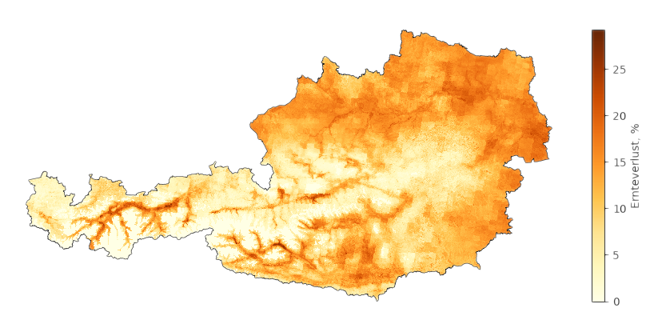

Welcome to ARIS_lite's Documentation!
=====================================

Overview
--------

ARIS_lite is a Python framework designed to compute plant stress indicators from meteorological data and model soil water balance. The package provides tools for:

- Processing meteorological input data
- Modeling soil water balance
- Calculating various plant stress indicators

Key Features
------------

- Modular architecture for easy extension
- Extensible for different plant types and environments

Key Limitations
---------------

- Strict requirements on usage (users need to follow the intended usage,
  including data format, directory structure, and variable names)
- Limited set of crops implemented

Getting Started
---------------

To learn more about using ARIS_lite, please refer to the following sections:

.. toctree::
   :maxdepth: 1

   installation
   usage

For detailed technical documentation, see the API documentation:

.. toctree::
   :maxdepth: 1

   aris_lite
